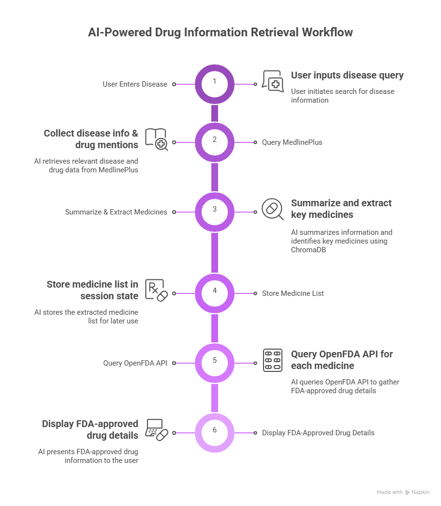
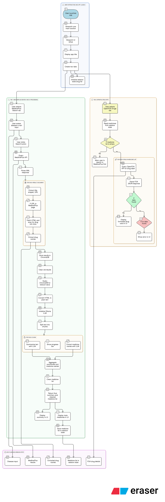

# Zero-Cost AI for Healthcare: Semi-Agentic Biomedical Pipeline with Ollama Mistral, MedlinePlus &amp; FDA
This pipeline leverages a semi-agentic design - combining rule-based retrieval (structured APIs, ChromaDB semantic search) with AI reasoning components (summarization and drug extraction via Mistral). The result is a streamlined system that:
### Retrieves medical information from MedlinePlus
### Uses LLM-powered reasoning to summarize text and extract key medicines
### Enriches drug details using FDA's open drug label API
### Operates at zero infrastructure cost using local AI (Ollama), open datasets, and free libraries

With a simple Streamlit interface, users can enter any disease, instantly get concise medical summaries, identify primary drugs, and view FDA-approved drug details.
This project demonstrates how data science + AI + open biomedical resources can be combined into a practical, cost-efficient, semi-agentic healthcare pipeline - making it a strong example of real-world AI engineering for biomedical data. Overall workflow is as follows:-

### The project's comprehensive process is shown below.

### Now, anyone can install and run it
### After downloading, in command prompt type
"pip install -e ."
### Then run with streamlit
"streamlit run medintel/app.py"

Install Ollama from https://ollama.com/download and let it operate in the background. Then, to pull deepseek-r1:1.5b, use the following command.
